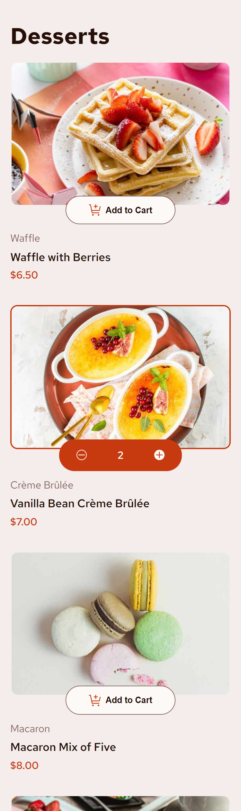
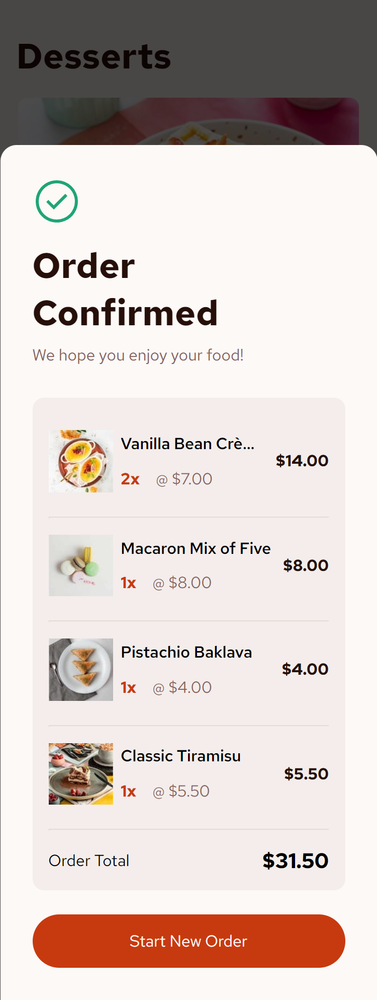
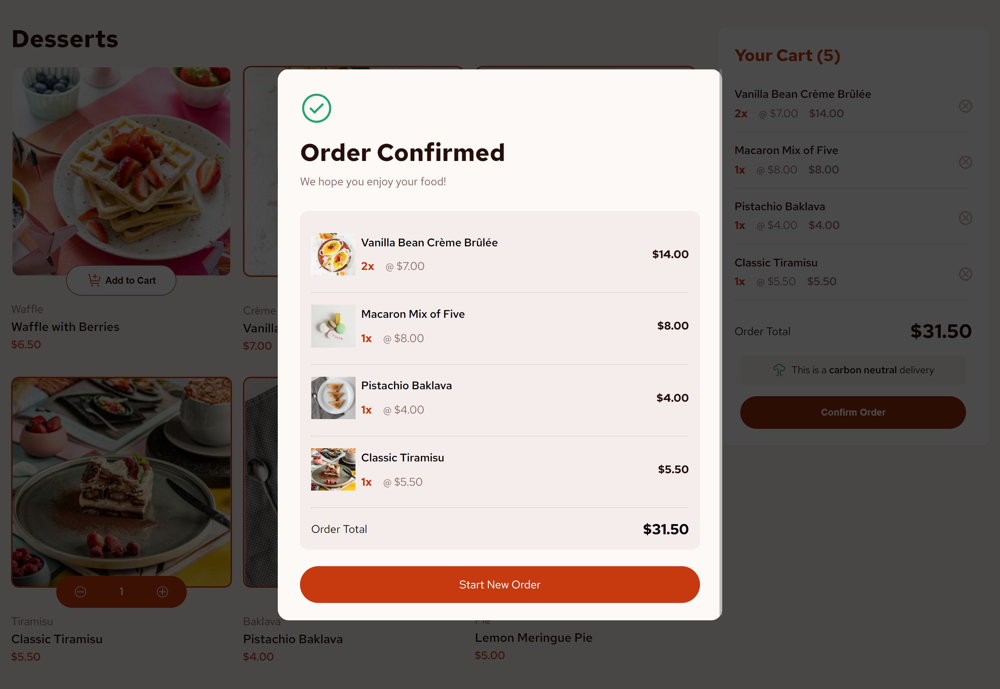

# Frontend Mentor - Product list with cart solution

This is a solution to the [Product list with cart challenge on Frontend Mentor](https://www.frontendmentor.io/challenges/product-list-with-cart-5MmqLVAp_d). Frontend Mentor challenges help you improve your coding skills by building realistic projects.

### The challenge

Users should be able to:

- Add items to the cart and remove them
- Increase/decrease the number of items in the cart
- See an order confirmation modal when they click "Confirm Order"
- Reset their selections when they click "Start New Order"
- View the optimal layout for the interface depending on their device's screen size
- See hover and focus states for all interactive elements on the page

### Screenshot

Mobile

Mobile Modal

Desktop

Desktop modal

### Links

- Solution URL: [https://www.frontendmentor.io/solutions/desserts-with-cart-react-efJswMtcRO](https://www.frontendmentor.io/solutions/desserts-with-cart-react-efJswMtcRO)
- Live Site URL: [https://dev-paull.github.io/dessert-with-cart/](https://dev-paull.github.io/dessert-with-cart/)

## My process

I wanted to learn how to build a shopping page with a cart, so I chose this challenge as my second React project.

- 📸 Analyzed screenshots to organize the page and its components.
- 📱 Focused on the simpler mobile design first 
- 🛒 Implemented cart functionality (adding, removing, changing item quantities) step by step to ensure thorough understanding.
- 🎨 Imported font and colors, then designed the components
- 🖥️ Adapted the layout for tablet and desktop :
  - Mobile: One dessert per row, cart at the end of the page.
  - Tablet: Two desserts per row, cart on the right.
  - Desktop: Three desserts per row, cart on the right.
- ✅ Added the confirmation modal and styled it for all device sizes.
- 🌀 Implemented animations for link and button hovers, adding items to the cart, and modal.
- 🌐 Started adding ARIA rules. I am currently learning about screen readers and how to ensure a good experience for all users.

### Built with

- **React**
- Vite
- Semantic HTML5 markup
- CSS custom properties
- Flexbox & Grid
- Mobile-first workflow

# Any feedback welcome 👍